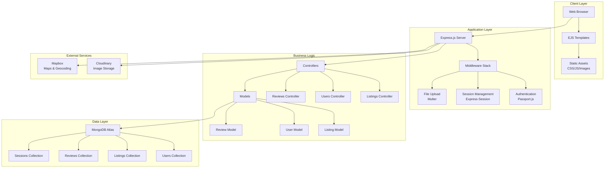
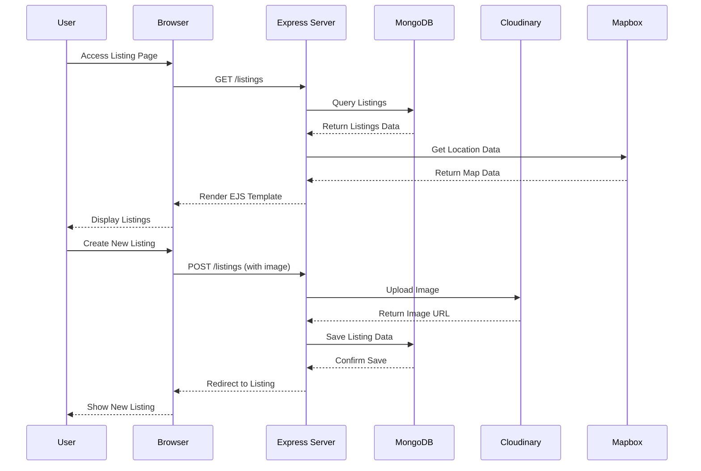
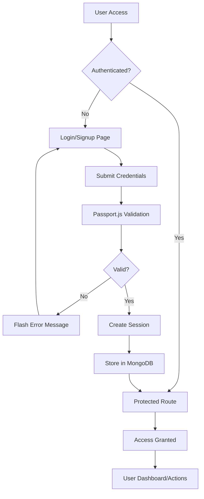
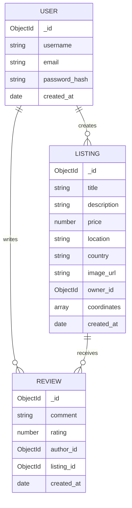
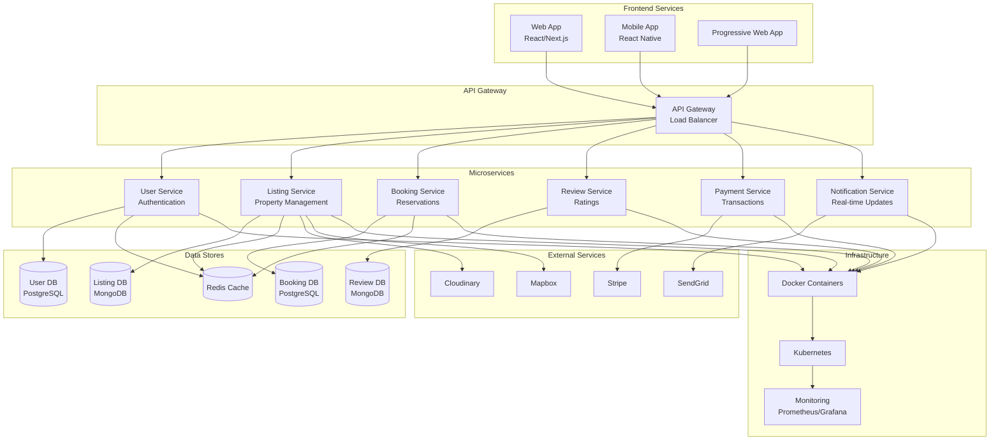
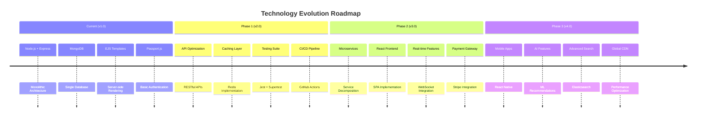

# 🏠 WanderLust - Book Your BnB

WanderLust is a full-stack web application for booking bed-and-breakfast stays, inspired by Airbnb. It allows users to explore, list, and review BnBs. The project includes features such as authentication, booking, map integration, cloud image upload, and a review system.

---

## ✅ Live Demo

🌍 [Explore Book Your BnB](https://course-project-bnb.onrender.com/listings)

---

## 🚀 Features

- 🧭 **Interactive BnB Listings**  
  View and search BnBs with image galleries and detailed descriptions.

- 🔐 **User Authentication**  
  Sign up, log in, and manage your listings and bookings securely.

- 📍 **Map Integration**  
  View location maps for each BnB using Mapbox.

- 🌥️ **Cloud Image Upload**  
  Upload images directly to Cloudinary.

- 💬 **Reviews & Ratings**  
  Leave reviews and ratings on BnB stays.

- 📦 **Full CRUD Functionality**  
  Create, update, and delete listings and reviews.

---

## 🧱 Tech Stack

### 🌐 Frontend
- EJS (Embedded JavaScript templates)
- HTML, CSS, Bootstrap

### 🛠 Backend
- Node.js + Express
- MongoDB + Mongoose
- Passport.js for authentication
- Multer for file uploads
- Cloudinary for image hosting
- Mapbox for map integration

---

## 🏗️ System Architecture

### Current Architecture Overview



### Data Flow Architecture



### Authentication Flow



### Database Schema Relationships



### Future Architecture (Microservices)



### Technology Stack Evolution



---

## ⚙️ Installation & Setup

### 1. Clone the Repository

```bash
git clone https://github.com/Ishu077/Course_Project_BNB.git
cd Course_Project_BNB
### 2. Install Dependencies

```bash
npm install
### 3. Configure Environment Variables
Create a .env file in the root directory and add the following:
```bash
CLOUDINARY_CLOUD_NAME=your_cloud_name
CLOUDINARY_KEY=your_api_key
CLOUDINARY_SECRET=your_api_secret
MAPBOX_TOKEN=your_mapbox_token
DB_URL=your_mongo_connection_string
SESSION_SECRET=your_session_secret
### 4. Start the Server
```bash
npm start

### 5. Visit Locally
```bash
Open your browser and go to:
http://localhost:8080


